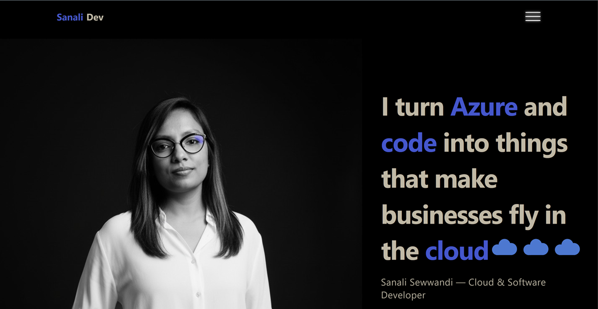

# Sanali Sewwandi — Portfolio (v2)

Modern personal portfolio built with **React + Vite**, **Tailwind CSS**, and **GSAP**.  
Includes projects showcase, LIA intro, tech stack physics, dedicated **Resume page**, and a contact flow powered by **EmailJS**.



## 🔗 Live
- **Demo:** https://portfolio-v2-ol2u.vercel.app
- **Resume page:** https://portfolio-v2-ol2u.vercel.app/resume

---

## ✨ Features

- **Hero** with animated headline (ScrambleText) and reveal
- **Projects Showcase** with responsive carousel & uniform cards
- **“Now Building”** board (progress, status, links)
- **Tech Stack** physics playground (Matter.js + GSAP)
- **Resume** as a dedicated route (`/resume`) with “Take me home!” CTA
- **Contact** stepped form (Message → Email → Subject) via **EmailJS**
- **CV request modal** (collects email + optional name, not auto-sending)
- Router-aware navbar: section scroll on home, page navigation on `/resume`
- Solid background everywhere to avoid pin/overflow glitches

---

## 🛠️ Tech Stack

- **Frontend:** React 18, Vite, React Router
- **Styling:** Tailwind CSS, custom SCSS tokens
- **Animation:** GSAP + ScrollTrigger + SplitText
- **Physics:** Matter.js (Tech Stack section)
- **Email:** EmailJS (client-side)
- **Build/Deploy:** Vite, (recommended) GitHub Pages / Netlify / Vercel / Azure Static Web Apps

---
src/
App.jsx # Router + Navbar + routes
index.css / styles/ # Tailwind + global SCSS (solid backgrounds, pin fixes)
components/
Navbar.jsx
ConfettiBurst.jsx
pages/
HomePage.jsx
ResumePage.jsx
sections/
Hero.jsx
About.jsx
ProjectIntro.jsx
ProjectsShowcase.jsx
NowBuilding.jsx
Timeline.jsx
LiaIntro.jsx
TechStack.jsx
ContactSection.jsx
ResumeSection.jsx
lib/
contactSchema.js # zod schema for contact steps (if used)


---

## ▶️ Getting Started (Local)

```bash
# 1) install
pnpm i   # or: npm i / yarn

# 2) dev
pnpm dev # http://localhost:5173

# 3) build
pnpm build

# 4) preview production build (optional)
pnpm preview


Requires Node 18+ recommended.

🔒 Environment Variables

Create a .env (or .env.local) at the repo root:

VITE_EMAILJS_PUBLIC_KEY=your_public_key_here
VITE_EMAILJS_SERVICE_ID=your_service_id_here

# templates you have in EmailJS
VITE_EMAILJS_TMPL_TO_ME=template_for_contact_message
VITE_EMAILJS_TMPL_AUTOREPLY=template_for_auto_reply   # optional

EmailJS setup tips

In ContactSection we call emailjs.send(SERVICE_ID, TEMPLATE_TO_ME, {...}).

To make replies go to the sender, set your template’s Reply-To to use a variable, e.g. {{from_email}}.

In ResumeSection the “Download CV” button opens a modal and sends only a request (you’ll reply manually). Template can reuse your contact template with a kind: "cv_request" flag or add a second template if available.

If you can’t add more templates, reuse one and branch in the template body using variables (e.g. show different intro when kind === "cv_request").

🧭 Routing

/ → HomePage with sections (#home, #about, #projects, #techstack, #contact…).

/resume → ResumePage with floating “Take me home!” link back to /#home.

The navbar:

If on /, in-page smooth scrolling to section IDs.

If on /resume, clicking a section link navigates to /#sectionId.

🧩 Adding/Editing Projects

Open src/sections/ProjectsShowcase.jsx and edit the projects array:

{
  name: "TomatoPizza API",
  image: "/projects/tomatopizza-swagger.png",
  description:
    "REST API for pizza ordering — dishes, ingredients, orders, and admin endpoints. Deployed on Azure with Swagger docs.",
  gradient: ["#8E2DE2", "#4A00E0"],
  tech: ["C#", "ASP.NET", "SQL", "Swagger", "Azure"],
  url: "https://github.com/RMSSanali/tomatopizza-api",
}


Notes:

All cards have a fixed height. Description is clamped to 3 lines. Tech chips are capped (with +N more pill) to keep sizes identical.

📄 Resume

The PDF lives in public/cv/Sanali_Sewwandi_CV.pdf.

Buttons on /resume:

Download CV → opens modal to collect an email. You’ll send CV manually.

Email / GitHub / LinkedIn quick links.

Success/failure states are handled in the modal.

🧪 Accessibility & Performance

Focus outlines are preserved on interactive elements.

Animations are reduced when prefers-reduced-motion: reduce.

Solid backgrounds on pin-spacer elements to avoid grey seams.

Consider adding Lighthouse, Playwright, and CI later.

🚀 Deployment
Netlify / Vercel

Framework: Vite (defaults are fine).

Ensure environment variables are configured in the dashboard.

GitHub Pages
# Example with gh-pages
pnpm build
# then upload /dist to gh-pages or use an action

Azure Static Web Apps

Choose your repo & branch

App location: /

Build command: pnpm build

Output: dist

🧰 Scripts (package.json)
{
  "scripts": {
    "dev": "vite",
    "build": "vite build",
    "preview": "vite preview --port 4173"
  }
}

🤝 Credits

GSAP + ScrollTrigger for animations

Matter.js for the tech stack physics

EmailJS for client-side email sending

Lucide React for icons

📜 License

MIT © 2025 Sanali Sewwandi

## 📁 Project Structure (key parts)

